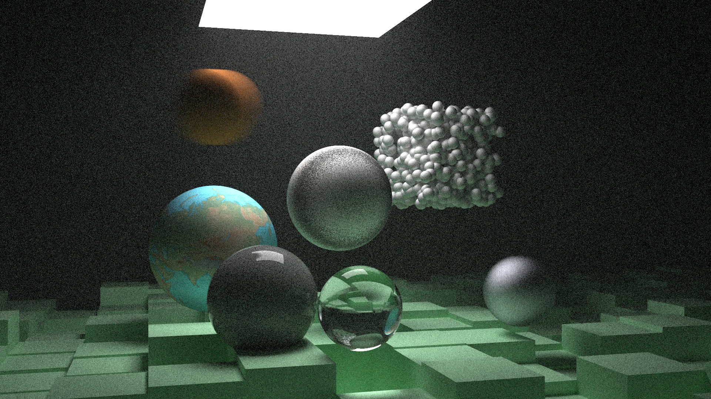

# Weekend Ray Tracer

Ray Tracer based on the [Ray Tracer in One Weekend booklet](http://www.realtimerendering.com/raytracing/Ray%20Tracing%20in%20a%20Weekend.pdf).

### Example Result

Yes, it's the same scene as in the second booklet, recreated with this ray tracer

It shows some of its features, including textures, glass, metal, subsurface scattering, cubes, motion blur and volumetric rendering. The noise is pretty significant in this image, but would improve with increased number of samples per pixel.

Another image, showing the Utah teapot in glass, imported as a `.obj` file

### Differences from original
- Multithreaded with `pthreads`
- Using [HConLib](https://github.com/TheVaffel/HConLib) (`FlatAlg`) for linear algebra
- Outputs in `.png` format using `OpenImageIO`
- Supports Wavefront `.obj` format

#### Features from [Ray Tracing the Next Week](http://www.realtimerendering.com/raytracing/Ray%20Tracing_%20The%20Next%20Week.pdf)

- Motion blur
- Bounding Volume Hierarchy (BVH)
- Volumetric Rendering
- Cubes

### Some Optimization Measurements

- Original serial program: 56.882 s
- Parallelized with 8 threads, each thread is pre-allocated a chunk of contiguous rows: 16.157 s (speedup of 3.5)
- Parallelized with 8 threads, each thread continues to fetch new rows to compute until all rows are taken: 13.763 s (speedup of 4.13 from original)
- After motion blur was implemented, I measure 33.128 s on same laptop and same configuration as above. (Might also be because laptop is unplugged and low on power).
- In the exact same setting as the above measurement, the implementation with BVH measures 2.652 s, a speedup of 12.49 (!)

Measurements were done using an i7 with 8 cores (including hyperthreading) on a five year-old laptop on battery.
It produced an image with dimensions 400 x 225, 100 samples per pixel and a depth limit of 50.

### Usage

Run the compile script, and if everything is in order (you need `OpenImageIO` and `pthread` development packages), you should be able to run the program. The scene to render is determined entirely programatically within `main.cpp`.

### Potential issues / improvements

- All configuration (image width, height and output image etc.) is done inside the `main.cpp` file, which means the program must be recompiled between each change.
[x] Only spheres can be rendered at this point. I mean, if you look at atoms as tiny spheres of certain colors (which they really aren't) and assume perfect precision and infinite compute power (which I am gonna go ahead and assume that you don't have), this is enough. Otherwise, adding new components would be nice.
[x] Support triangular formats (with fancy file I/O maybe?)
- The code is inconsistent in which of the terms `vec3` (from the booklet) and `Vec3` (standard in `FlatAlg`) to use.
